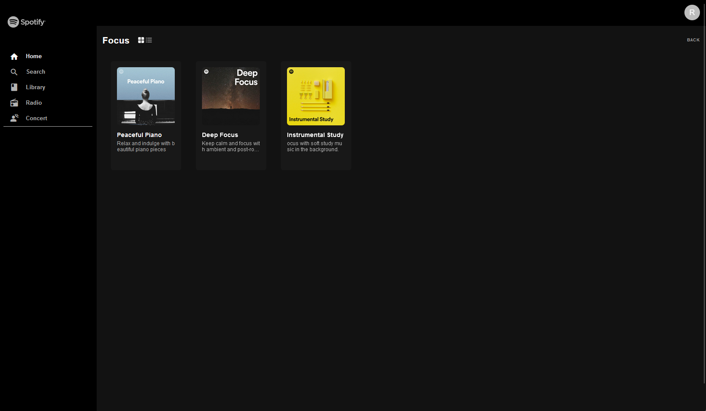

# Description

The application was develop to look like a spotify demo. So a user can enter in the website, search for the song and explore the playlist without a registration. To achive this goal, the application use Rapid Api Spotify service. Feel free to choose one of the most rated api. In addition was implemented also the original spotify api to retrive info to the premium spotify user logged in the application. Reade the section below to setup the variables necessary to run correctly the web app.

## IMPORTANT!

To run the project you have to create .env file with these keys:

Spotify developer api enviroment

1. Go to 'https://developer.spotify.com/dashboard'
2. Create a new app "new app"
   - Redirect Uri must be "http://localhost:3000"
3. Then copy the client_id and the client_secret in the current .env variables
   - REACT_APP_CLIENT_ID=<>
   - REACT_APP_CLIENT_SECRET=<>

Rapid Api keys

1. Go to 'https://rapidapi.com' and Sign up
2. Then got to https://rapidapi.com/airaudoeduardo/api/spotify81/ and register to get the api key
3. Copy the api key and api host in the current .env variables:
   - REACT_APP_X_RAPID_KEY=<>
   - REACT_APP_X_RAPID_HOST=<>

Make sure to not include '' or "" in env variables.

# Overview

### Home

### Home-read-more

### Home-read-more-view-2

### Playlist

### Search

### Track

# Getting Started with Create React App

This project was bootstrapped with [Create React App](https://github.com/facebook/create-react-app).

## Available Scripts

In the project directory, you can run:

### `npm start`

Runs the app in the development mode.\
Open [http://localhost:3000](https://localhost:3000) to view it in your browser.

The page will reload when you make changes.\
You may also see any lint errors in the console.

### `npm run build`

Builds the app for production to the `build` folder.\
It correctly bundles React in production mode and optimizes the build for the best performance.

## Issue

- The search song is not well performed
- Better implementation of spotify API from spotify.com (like, favorites, current song...)
- User section and settings

## Future implementation

- Implementation of festival api
- Implementation of National Radio
